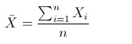
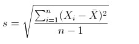
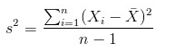
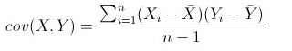
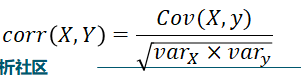
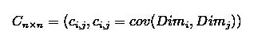
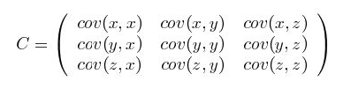
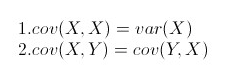

协方差
==========

1. 概念
----------

均值:

标准差:

方差:

协方差:

相关系数:

协方差矩阵:

我们可以举一个简单的三维的例子，假设数据集有三个维度，则协方差矩阵为：

2. 性质
----------

3.协方差其意义
-----------------

https://blog.csdn.net/GoodShot/article/details/79940438